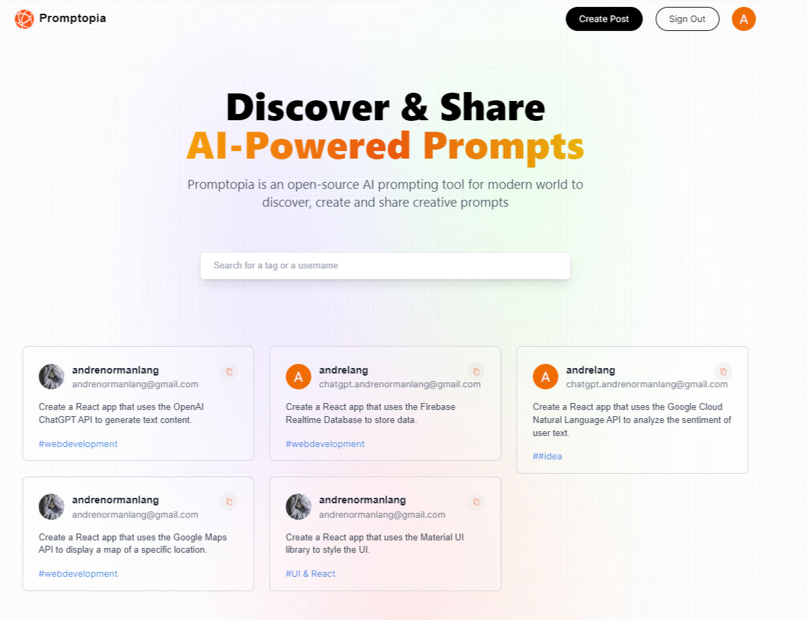

# Promptopia is a Next.js 13 Full Stack App Using the Official React Framework

Following the tutorial of this app I got a glance of how the following works:
- Next.js 13 App Folder Structure
- Next.js 13 Client Components vs Server Components
- Next.js 13 File-based Routing (including dynamic and nested routes)
- Next.js 13 page, layout, loading, and error Special Files
- Next.js 13 Serverless Route Handlers (Next API, Full Stack Apps)
- Next.js 13 Metadata and Search Engine Optimization (SEO)
- Three ways to fetch data in Next.js:
   - Server Side Rendering (SSR),
   - Static Site Generation (SSG)
   - Incremental Static Generation (ISR)

For the full tutorial visit the following link: 
[Javascript Mastery - Next.js 13 Full Course 2023 | Build and Deploy a Full Stack App Using the Official React Framework](https://www.youtube.com/watch?v=wm5gMKuwSYk) 